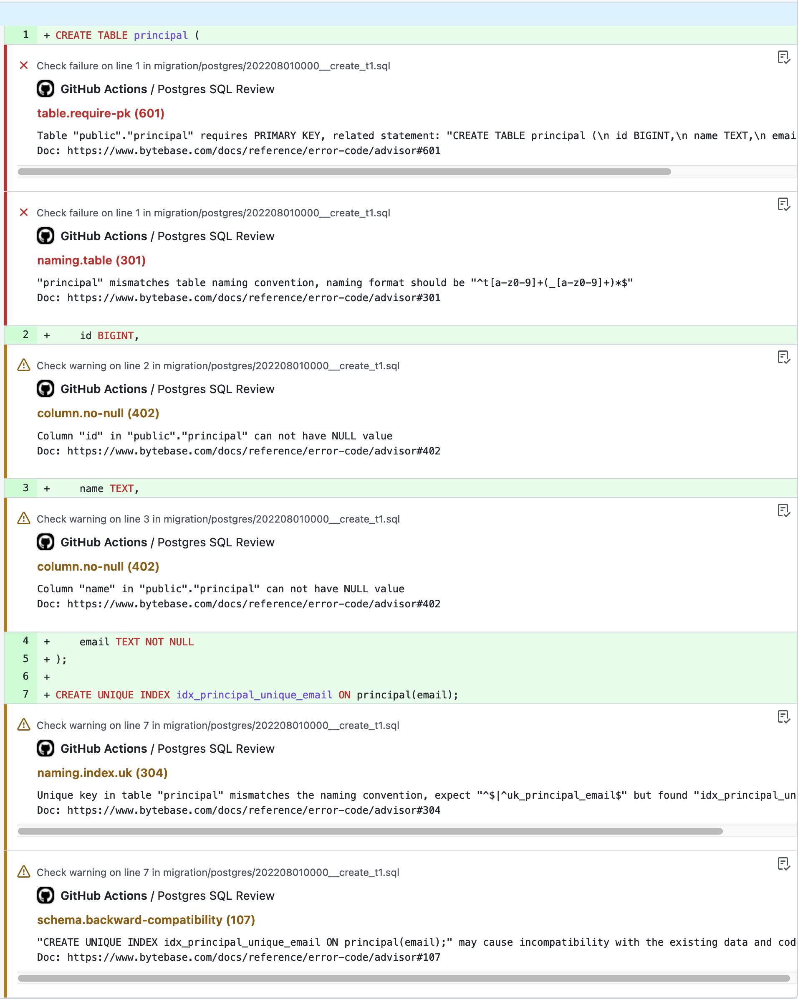

# Bytebase SQL Review Action

The GitHub Action for SQL Review. Parse and check the SQL statement according to the SQL review rules.

## Usage

Create a file in `.github/workflows/sql-review.yml` in your repository and insert the following content:

```yml
on: [pull_request]

jobs:
  sql-review:
    runs-on: ubuntu-latest
    name: SQL Review
    steps:
      - uses: actions/checkout@v3
      - name: Check SQL
        # TODO: use a specific version
        uses: bytebase/sql-review-action@main
        with:
          files: "<The path for your SQL files>" # Optional.
          override: "<Your SQL review rules configuration file path>" # Optional, we can only provide the template id
          database: "<Database type>"
          template: "<SQL review rule template id>" # Optional. Required if the override is not specified.
```

The action will be triggered in any pull request which has SQL files changed. It will call the SQL review service to check if the change is valid according to the SQL review rules.

### About parameters

- `files`: The path for your SQL files. **Optional**, default `**/*.sql`.
- `override`: Your SQL review rules configuration file path. **Optional** if you provide the template id and don't want to customize rules. You can configure and generate this file in [Bytebase SQL Review Guide](https://www.bytebase.com/sql-review-guide) page.
- `database`: Your database type. **Required**, should be one of `MYSQL`, `POSTGRES` or `TIDB`.
- `template`: The SQL Review rule template id. **Optional** if you provide the `override` parameter. Should be one of `bb.sql-review.prod` or `bb.sql-review.dev`.

## Example

Once you configure the action, you can get these error or warning message based on your SQL review rules:



Go to the `./example/` folder to see how to configure the workflow and override SQL review rules.

Go to [bytebase](https://github.com/bytebase/bytebase) for a real example.
